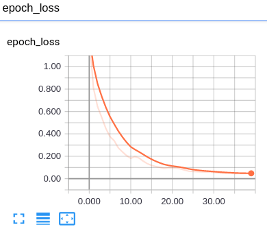

# ECG Time Series Classification
Fine-tuning VGG16 and Inception-Resnet V2 to classify ECG signals in two different classes, basically normal and abnormal.

## Data
1. 100 original TRAIN data, 100 original TEST data. Here is some samples from TRAIN set:

2. Split TRAIN into 90 *train* set and 10 *val*(validation) set;
3. Augment *train* and *val* sets:
    * *train*:  (1440, 96)
    * *val*: (160, 96)

## VGG16

### Results
* Achieve 0.955 TEST accuracy for now on TEST dataset with 100 data
* train acc and loss:

* validation acc:

* Evaluate TEST set:

